# Playwright Global Setup Failure

## Exceptions in `globalSetup`

An uncaught exception in `globalSetup` prevents Playwright from running the tests. Playwright stops the execution and never reports test results to **any** of its reporters (including Currents).

A normal case when `globalSetup` is successful:


When `globalSetup` throws:

```mermaid
sequenceDiagram
    User->>PW: playwright test --project XXX
    PW->>GlobalSetup: run global setup
    GlobalSetup->>GlobalSetup: 💥 exception!
    PW-->>Reporter: running 0 tests in 0 projects (no tests)
    activate Reporter

    Reporter->>Reporter: Nothing to report 😔
    deactivate Reporter
    PW->>User: Done
```



## Example

This repo `packages/global-setup`:

- has [`global-setup.ts`](./global-setup.ts) that always throws
- has Currents and the default `html` reporter [configured](./playwright.config.ts): `reporter: [currentsReporter(currentsConfig), ["html"]]`

Running:

```sh
npx playwright test
```

- Playwright doesn't report any tests - only the global error.
- Currents (and other reporters) get no test results.


## Multi-shard Environments

For multi-shard runs, `globalSetup` can succeed on some shards and fail on others.

- Successful shards will scan and report the list of tests that are supposed to be reported, but will only run as subset of tests allocated for the shar
- Failed shards will never run the tests

As a result, Currents marks the associated run as timedout because some tests were never reported.
