# Playwright Global Setup Failure

An uncaught exception in `globalSetup` prevents Playwright from running the tests. Playwright stops the execution and never reports test results to **any** of its reporters (including Currents).

A normal case when `globalSetup` is successful:


When `globalSetup` throws:

```mermaid
sequenceDiagram
    User->>PW: playwright test --project XXX
    PW->>GlobalSetup: run global setup
    GlobalSetup->>GlobalSetup: 💥 exception!
    PW-->>Reporter: running 0 tests in 0 projects (no tests)
    activate Reporter

    Reporter->>Reporter: Nothing to report 😔
    deactivate Reporter
    PW->>User: Done
```



The example in this repo has Currents and the default `html` reporter configured: `reporter: [currentsReporter(currentsConfig), ["html"]]`:

- Playwright doesn't report any tests - only the global error.
- Currents (and other reporters) get no test results.

```sh
npx playwright test
```

For multi-shard setup, `globalSetup` can succeed on some shards and they will send the list of all the expected tests to Currents.
